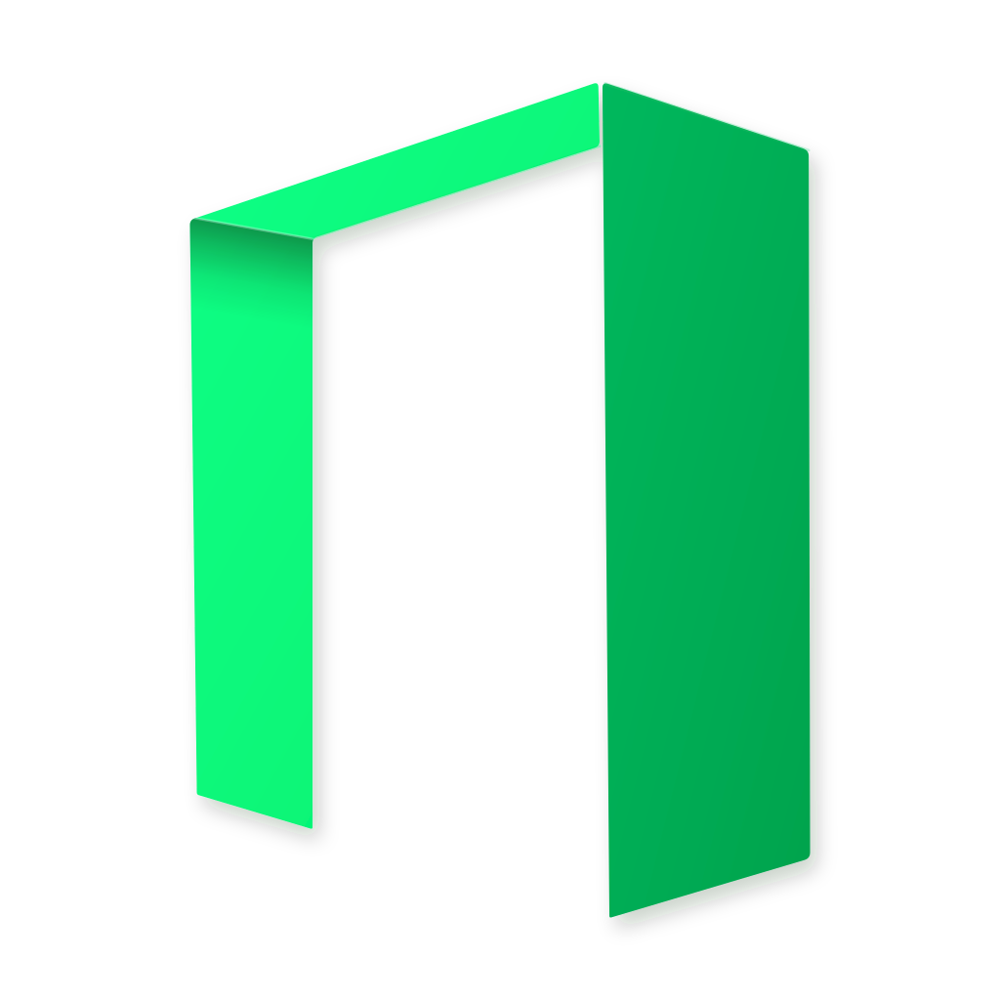

<p align="center">
  
</p>

# Wibe

**English** · [简体中文](README.zh-CN.md)

Wibe is a desktop editor based on [Visual Studio Code — Open Source](https://github.com/microsoft/vscode) (**Code - OSS 1.136.1**). The editor, extensions host, and settings layout stay upstream. On top of that, Wibe ships a local agent that talks to the AI websites you already use — in a real browser, on your machine.

**Version:** `alpha-1.0.0-base-1.136.1`
Wibe **1.0.0 alpha**, built on Code - OSS **1.136.1**.

> **Tested only on DeepSeek** ([chat.deepseek.com](https://chat.deepseek.com)). Other sites may have built-in automations in the sidecar, but this build has **not** been verified on them.

---

## Why it exists

Most “AI IDEs” send your repo to a hosted API. Wibe does the opposite:

1. You log into ChatGPT, Claude, Gemini, DeepSeek, Kimi, … in a **controlled Chrome** that Wibe starts.
2. A local Python sidecar (**UWA**) turns that logged-in tab into an OpenAI-compatible endpoint at `http://127.0.0.1:8199/v1`.
3. The built-in **InControl** chat talks to that endpoint. Each IDE session is bound to one web conversation, so continuing in the sidebar continues the same page, and compacting / switching models opens a new page and rebinds.

Nothing leaves your computer except the traffic you already make to those sites.

---

## Run

1. Launch `Wibe.exe` from a packaged Windows build.
2. Wait for the controlled Chrome window. Sign in to **DeepSeek** (the only site this build is tested on) and leave it on a real chat page.
3. Open the InControl chat in the side bar and talk as usual.

**Startup no longer opens the tutorial / docs page** in your system browser. If you need it:

| What | URL |
| --- | --- |
| Sidecar dashboard | http://127.0.0.1:8199 |
| Tutorial | http://127.0.0.1:8199/static/tutorial/index.html |
| OpenAI-compatible base URL | `http://127.0.0.1:8199/v1` |

The profile folder is still `.vscode-oss`, so Wibe and a stock Code - OSS install can share settings, or run side by side (different mutex).

---

## What is different from vanilla Code - OSS

| Area | Vanilla | Wibe |
| --- | --- | --- |
| Product name / icon | Code - OSS | **Wibe** (display layer only) |
| Chat | Copilot / none | **InControl** built-in extension |
| Model runtime | Cloud API keys | **UWA sidecar** → your logged-in AI websites |
| Session identity | n/a | One IDE session ↔ one web conversation URL |
| Compact / switch model | n/a | Summarise, open a **new** web chat, rebind the slot |
| Settings path / CLI / URI | `.vscode-oss`, `code-oss://` | **Unchanged** on purpose |

Deeper maps: [docs/uwa-vs-vanilla-vscode.md](docs/uwa-vs-vanilla-vscode.md) (delta vs upstream) and [docs/uwa-incontrol-bridge.md](docs/uwa-incontrol-bridge.md) (protocol).

```
Wibe.exe  (Electron / Code - OSS)
  └── extensions/incontrol          TypeScript chat client
        │  spawn, health, shutdown
        ▼
     uwa-sidecar  (Python, :8199)   OpenAI-compatible API + dashboard
        │  drives
        ▼
     Chrome --remote-debugging-port=9222
        └── DeepSeek (tested) / other sites (untested)
```

---

## Build from source

Need **Node.js** matching `.nvmrc`, **Python 3.10+**, and a Chromium browser (Chrome / Edge / Brave).

```bash
npm install
npm run build-fast              # fast workbench compile
npm run build-fast-extensions   # when extension media changes
npm run compile                 # full client + copilot
```

A full gulp package is not required for day-to-day work. After changing InControl or the sidecar, copy those folders into an already-packaged app’s `resources/app/` and reload the window:

```
this repository
  extensions/incontrol/
  resources/uwa-sidecar/
        │  mirror
        ▼
<packaged app>/resources/app/
  extensions/incontrol/
  resources/uwa-sidecar/
```

Do **not** edit `resources/uwa-sidecar/app/core/`. Sidecar customisation goes through `resources/uwa-sidecar/uwa-plugins/` so upstream sidecar updates do not clobber the bridge.

---

## Layout

| Path | Role |
| --- | --- |
| `product.json` | Display-name rebrand (`nameShort` / `nameLong` = Wibe). Identity keys such as `applicationName` and `dataFolderName` stay `code-oss` / `.vscode-oss`. |
| `extensions/incontrol/` | Chat UI, session slots, compaction, sidecar manager |
| `resources/uwa-sidecar/` | Local Web-to-API service |
| `docs/` | Bridge protocol and “vs vanilla” notes |
| `BRIDGE.md` | Short contract / do-not-break rules |
| `WIBE_VERSION` | Display version (`alpha-1.0.0-base-1.136.1`) |

---

## Use it as a local API

Any OpenAI-compatible client can point at the sidecar (the IDE already does):

```
Base URL:  http://127.0.0.1:8199/v1
API key:   any string if AUTH_ENABLED=false (default)
```

The sidecar ships selectors for several sites (ChatGPT, Claude, Gemini, DeepSeek, Kimi, Qwen, Grok, Doubao, Google AI Studio, Arena). **Only DeepSeek has been tested in this alpha.** Treat the others as untested.

---

## Notes

- Personal / research use. Respect each site’s terms. This is a local browser-automation bridge, not a hosted proxy and not a bypass for login, captchas, or paywalls.
- The editor is MIT (`LICENSE.txt`). The sidecar is AGPL-3.0 (`resources/uwa-sidecar/LICENSE`).
- Issues: the URL in `product.json` → `reportIssueUrl`.

## Acknowledgments

- Thanks to lumingya for the universal-web-api project (https://github.com/lumingya/universal-web-api); the `uwa-sidecar` component of this project is built and adapted based on it.
- Thanks to continuedev for the Continue project (https://github.com/continuedev/continue); the `incontrol` component of this project is a custom fork of Continue version 1.3.40.
